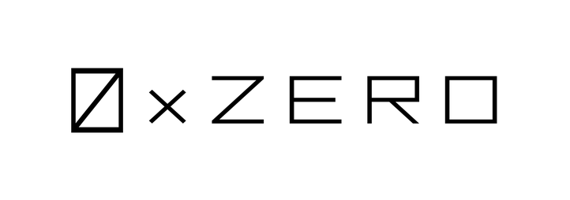
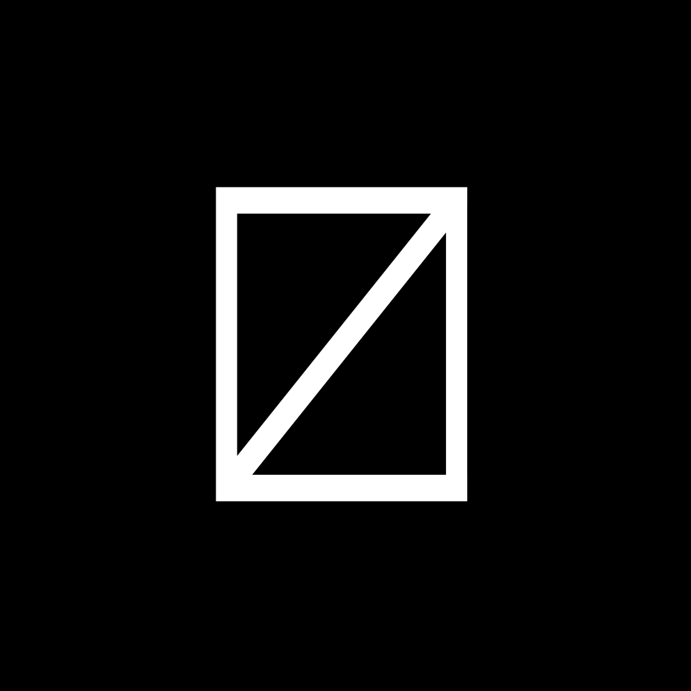

  

# ZERO Labs

## Who we are

### Foundry of innovation

We're a venture studio committed to solving the intricate challenges that hinder self-sovereignty. Our goal is to simplify the process of empowering individuals with control over their data, thereby safeguarding their privacy. Founded in Nigeria, we're dedicated to tackling global challenges and are collaborating with teams internationally to achieve the collective goal of empowering digital freedom.

## Our initiatives

### ZERO Protocol

  

ZERO is the identity layer for the new web. It empowers users to prove information from verifiable credentials through ZKPs(zero-knowledge proofs), as well as privately-held dynamic data via Web proofs (zkTLS). It enables a frictionless web3 experience for users as well as easy, seamless, compliant user data verification for developers.

###  OMID Wallet

  

OMID (omni-identity) wallet is an application that enables users interact with the ZERO Protocol. It gives them the ability to grant access to their provable (verifiable/dynamic) data, as well as permision the issuance of credentials. It serves as a way to provide users self-custody to their identities and let's them make the trust assumption for their data.

Yes, the distinguishing characteristics of our brand elements is the change in colour, hehe.

 * Entity: #ffffff
 * Protocol: #000000
 * Wallet: #adff2f
