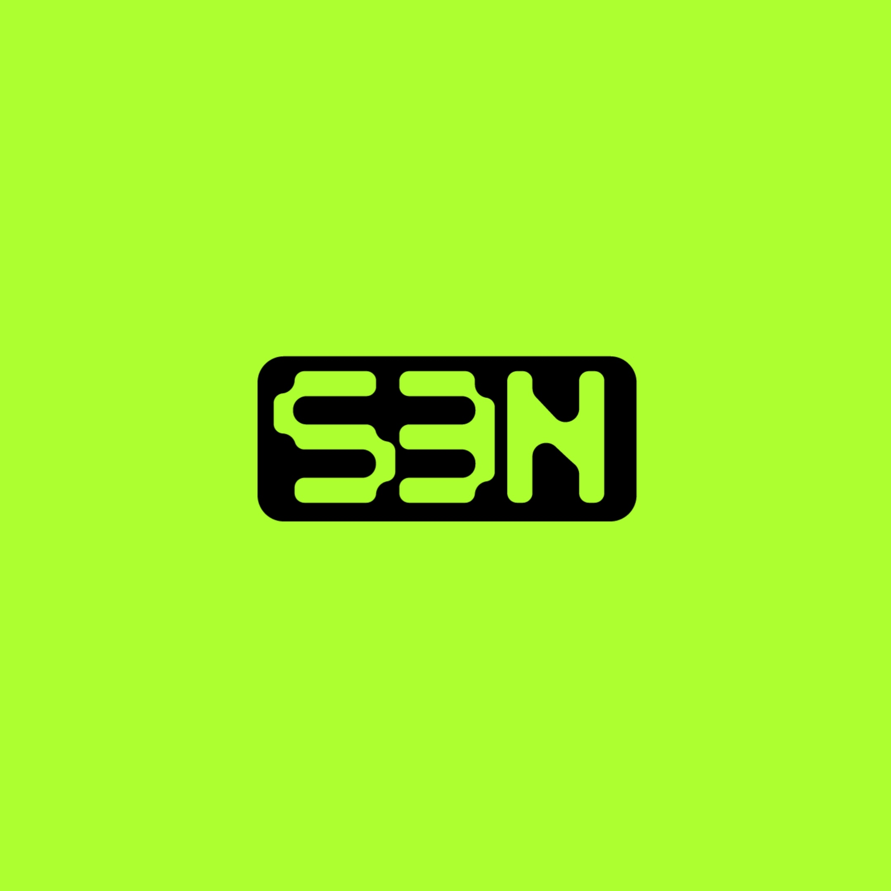

  

[![Chat on Twitter][ico-twitter]][link-twitter]

[ico-twitter]: https://img.shields.io/twitter/url?color=black&label=0xZeroOrg&logoColor=black&style=social&url=https%3A%2F%2Ftwitter.com%2F0xZeroOrg 

[link-twitter]: https://x.com/0xZeroOrg

## About us

We're a startup committed to solving the intricate challenges that hinder self-sovereignty. Our goal is to simplify the process of empowering individuals with control over their data, thereby safeguarding their privacy and empowering digital freedom.

## Our initiatives

### <a href="https://github.com/0xZeroLabs/s3n">S3N Protocol</a>

S3N is a decentralised self-sovereign identity solution that enables permissionless issuance, verifiable provenance, and trustless verification of credentials.

### <a href="https://github.com/0xZeroLabs/the-forge">The Forge</a>

The Forge is an AVS built on EigenLayer through the Othentic stack, designed to verifiably register any IP on Story Protocol with access to the unlimited IP of the internet.
