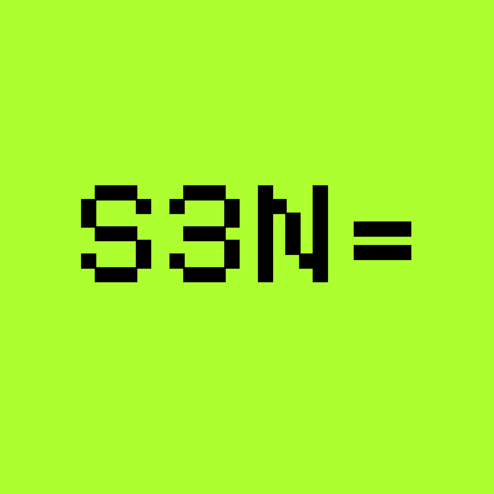

  

[![Chat on Twitter][ico-twitter]][link-twitter]

[ico-twitter]: https://img.shields.io/twitter/url?color=black&label=0xZeroOrg&logoColor=black&style=social&url=https%3A%2F%2Ftwitter.com%2F0xZeroOrg 

[link-twitter]: https://x.com/0xZeroOrg

## About us

We're a startup committed to solving the intricate challenges that hinder self-sovereignty. Our goal is to simplify the process of empowering individuals with control over their data, thereby safeguarding their privacy. Founded in Nigeria, we're dedicated to tackling global challenges and are collaborating with teams internationally to achieve the collective goal of empowering digital freedom.

## Our initiatives

### <a href="https://github.com/0xZeroLabs/s3n">S3N Protocol</a>

S3N is a decentralised self-sovereign identity solution that enables permissionless issuance, verifiable provenance, and trustless verification of credentials.

It integrates a trusted notaries AVS called Core, on EigenLayer as a secure replacement for signing credentials, thereby enabling an open ecosystem for secure identity without the explicit need for issuer permission.
